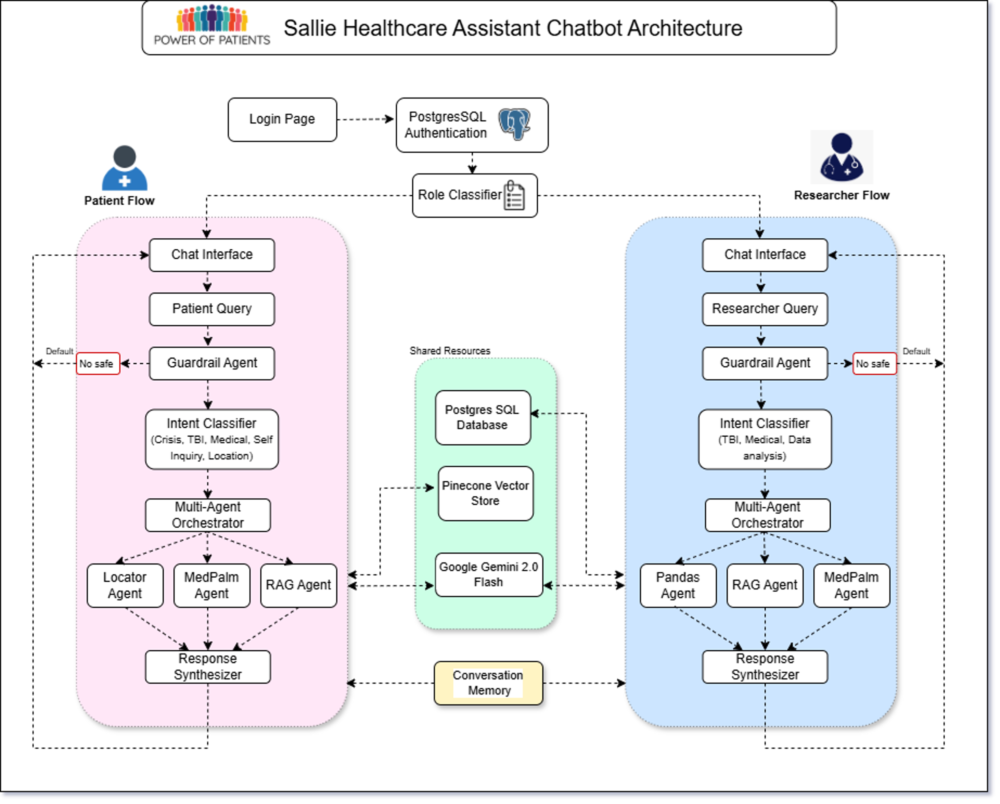

# Power of Patients - TBI Healthcare Assistant Platform

<p align="center">
  
  
  
</p>

## 🏥 Overview

Power of Patients is a comprehensive healthcare platform designed to empower Traumatic Brain Injury (TBI) patients and their caregivers. The platform features an AI-powered healthcare assistant named Sallie and provides advanced TBI assessment and risk analysis tools.

### Key Features

- **🤖 Sallie AI Healthcare Assistant**: An intelligent chatbot providing personalized medical support for TBI patients
- **📊 TBI Assessment & Risk Analysis**: Comprehensive assessment tools with clustering prediction capabilities
- **👥 Dual User Interface**: Separate interfaces for patients and researchers
- **🔒 HIPAA Secure**: Encrypted and compliant with healthcare data regulations
- **📍 Facility Locator**: Helps patients find nearby healthcare facilities
- **📚 Knowledge Base**: CDC-sourced articles and research papers on TBI

## Architecture


The platform consists of two main applications:

### 1. Sallie Healthcare Assistant Chatbot
- **Patient Flow**: Personalized medical assistance, symptom tracking, and location-based services
- **Researcher Flow**: Data analysis capabilities with Pandas integration
- **Multi-Agent System**: Orchestrated by intent classifiers and specialized agents
- **Guardrail Agent**: Ensures safe and appropriate responses

### 2. TBI Assessment & Risk Analysis Web App
- **Phenotype Analysis**: Advanced clustering and prediction models
- **Risk Assessment**: Using logistic regression and K-means clustering
- **Interactive Visualizations**: 3D cluster visualizations and assessment reports

## Getting Started

### Prerequisites

- Python 3.8+
- PostgreSQL
- SQL Server with ODBC Driver 17
- Node.js (for frontend components)

### Installation

1. **Clone the repository**
```bash
git clone https://github.com/rohit180497/power-of-patients-capstone.git
cd power-of-patients-capstone
```

2. **Create a virtual environment**
```bash
python -m venv venv
source venv/bin/activate  # On Windows: venv\Scripts\activate
```

3. **Install dependencies**
```bash
pip install -r requirements.txt
```

4. **Set up databases**
   - Create a PostgreSQL database
   - Set up SQL Server database
   - Run the SQL scripts in the `sql/` directory to create tables

5. **Configure environment variables**
   
Create a `.env` file in the root directory with the following variables:

```env
# Local SQL Server credentials
DB_SERVER=localhost
DB_DATABASE=your_database_name
DB_USERNAME=your_username
DB_PASSWORD=your_password
DB_DRIVER={ODBC Driver 17 for SQL Server}
DB_AUTH_MODE=windows

# Pinecone credentials (for vector storage)
PINECONE_API_KEY=your_pinecone_api_key
PINECONE_ENVIRONMENT=your_pinecone_environment
PINECONE_INDEX_NAME=your_index_name
PINECONE_INDEX2_NAME=your_second_index_name
OUTPUT_DIR="power_of_patients/ingestion/output"
INPUT_FILE="power_of_patients_data/simplified_all_articles.json"
EMBEDDING_MODEL="BAAI/bge-base-en-v1.5"

# PostgreSQL credentials
user=your_postgres_user
password=your_postgres_password
host=localhost
port=5432
dbname=postgres

# Google APIs
GEMINI_API_KEY=your_gemini_api_key
GOOGLE_PLACES_API_KEY=your_places_api_key
```

## Running the Applications

### 1. Running the Sallie Chatbot

```bash
cd app
python main.py
```

The chatbot will be available at `http://localhost:5000`

### 2. Running the TBI Assessment Web App

```bash
cd phenotypes/app
python app.py
```

The assessment app will be available at `http://localhost:5001`

## 📁 Project Structure

```
rohit180497-power-of-patients-capstone/
├── app/                          # Sallie Healthcare Assistant Chatbot
│   ├── main.py                   # Main application entry point
│   ├── patient_agent.py          # Patient-specific agent logic
│   ├── researcheragent.py        # Researcher-specific agent logic
│   ├── src/                      # Core modules
│   │   ├── guard/                # Guardrail agent for safety
│   │   ├── locator/              # Facility locator services
│   │   ├── medpalm/              # Medical assistant integration
│   │   ├── pandas/               # Data analysis agent
│   │   └── retrieval/            # CDC content retrieval
│   └── templates/                # HTML templates
    └── .env                      # contains all API keys
├── phenotypes/                   # TBI Assessment & Risk Analysis
│   ├── app/                      # Web application
│   │   ├── app.py                # Main Flask application
│   │   └── artifacts/            # ML models and scalers
│   └── scripts/                  # Analysis scripts
    └── data/                     # contains all the data
├── notebooks/                    # Data processing notebooks
│   ├── data_cleaning/            # Data preparation scripts
│   └── scraper/                  # CDC web scraping tools
├── sql/                          # Database schemas and queries
└── src/                          # Shared source code
```

## 🔧 Key Components

### Authentication System
- PostgreSQL-based authentication for secure user access
- Role-based access control (Patient vs Researcher)

### AI/ML Models
- **Google Gemini 2.0 Flash**: Powers the conversational AI
- **MedPalm Agent**: Specialized medical knowledge assistance
- **Clustering Models**: K-means clustering for patient phenotyping
- **Logistic Regression**: Risk assessment for immediate symptoms

### Data Sources
- CDC website scraped articles and research papers
- Patient demographic and symptom data
- TBI incident registration data

## 📊 Database Schema

The platform uses multiple databases:
- **PostgreSQL**: User authentication and session management
- **SQL Server**: Patient data, symptoms, and medical records
- **Pinecone**: Vector storage for semantic search

## 🛡️ Security & Compliance

- HIPAA compliant encryption
- Secure authentication system
- Guardrail agents to ensure safe AI responses
- No storage of personally identifiable information in vector databases

## 🤝 Contributing

We welcome contributions! Please follow these steps:

1. Fork the repository
2. Create a feature branch (`git checkout -b feature/AmazingFeature`)
3. Commit your changes (`git commit -m 'Add some AmazingFeature'`)
4. Push to the branch (`git push origin feature/AmazingFeature`)
5. Open a Pull Request

## 📝 License

This project is licensed under the MIT License - see the [LICENSE](LICENSE) file for details.

## 🙏 Acknowledgments

- Northeastern University for academic support
- CDC for providing comprehensive TBI research data
- Power of Patients organization for the project vision

## 📧 Contact

For questions or support, please contact:
- Project Lead: Rohit [rohitkosamkar18@gmail.com]
- Repository: [https://github.com/rohit180497/power-of-patients-capstone](https://github.com/rohit180497/power-of-patients-capstone)

---

**Note**: This project is part of a capstone project focused on improving healthcare outcomes for TBI patients through technology.